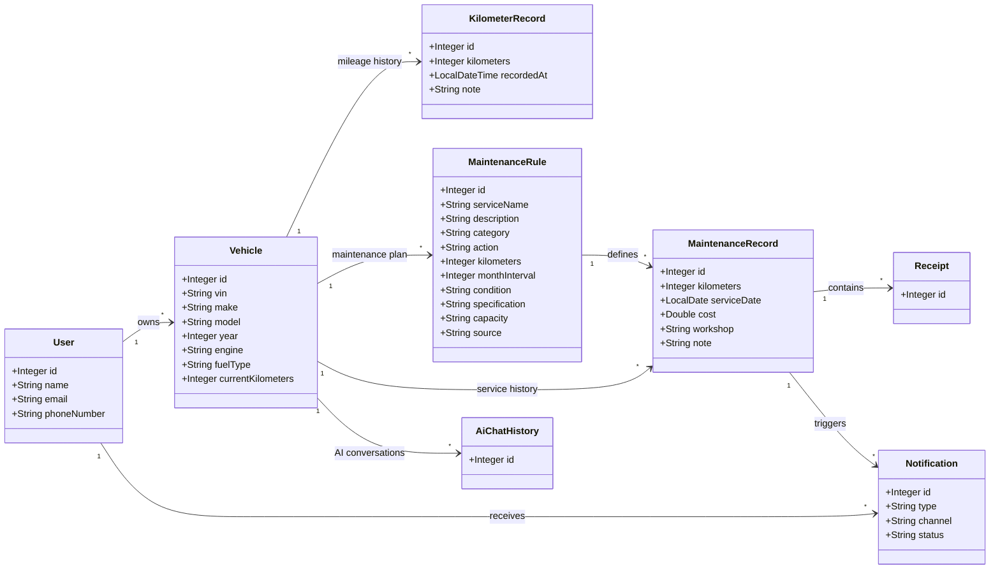

[Uploading RE# صَيّان | Sayyan

### Smart Vehicle Care & Maintenance Platform

**Sayyan** is a smart vehicle care platform designed to help vehicle owners manage their cars, track mileage, organize maintenance, store service records and receipts, receive maintenance notifications, and access AI-powered vehicle assistance.

---

## Team Members

- Nawaf
- Thikra
- Subhiyyah

---

## Overview

Vehicle owners often have maintenance information scattered across different places, making it difficult to track mileage, maintenance schedules, service history, receipts, and upcoming maintenance.

**Sayyan** provides a centralized vehicle care system that helps users organize and understand their vehicle's maintenance throughout the ownership lifecycle.

The platform allows users to:

- Manage multiple vehicles.
- Track vehicle mileage over time.
- Manage vehicle maintenance requirements.
- Record completed maintenance services.
- Store maintenance receipts.
- Receive maintenance notifications.
- Maintain vehicle-specific AI conversation history.
- Use AI-assisted features to better understand vehicle problems and maintenance information.

The backend is built using **Java and Spring Boot** with a relational database connecting users, vehicles, maintenance information, mileage history, and completed services.

---

## Tech Stack

| Technology | Usage |
|---|---|
| Java | Core programming language |
| Spring Boot | Backend framework |
| Spring Web | REST API development |
| Spring Data JPA | Database access |
| Hibernate | ORM and entity relationships |
| MySQL | Relational database |
| Jakarta Validation | Data validation |
| Lombok | Reducing boilerplate code |
| Spring AI | AI integration |
| REST Client | External API communication |
| Maven | Dependency management |

---

# Database Design

Sayyan uses a relational database consisting of **8 main entities**, with the `Vehicle` entity acting as the central part of the system.

## UML Diagram



---

## Entities

### User

Represents a registered vehicle owner.

The user can:

- Own multiple vehicles.
- Receive multiple notifications.

---

### Vehicle

Represents a vehicle registered under a user.

It stores information such as:

- VIN
- Make
- Model
- Year
- Engine
- Fuel type
- Current kilometers

The vehicle acts as the central entity connecting the major parts of the platform.

---

### KilometerRecord

Stores historical odometer readings for a vehicle.

Instead of keeping only the current mileage, Sayyan maintains a history of kilometer readings that can be used to understand how the vehicle is being driven over time.

Each kilometer record belongs to one vehicle.

---

### MaintenanceRule

Represents a maintenance requirement associated with a specific vehicle.

A maintenance rule can contain:

- Service name
- Description
- Category
- Action
- Kilometer requirement
- Month interval
- Condition
- Specification
- Capacity
- Source

Each maintenance rule belongs to one vehicle.

---

### MaintenanceRecord

Represents a maintenance service that has actually been performed on a vehicle.

It can store:

- Service kilometers
- Service date
- Cost
- Workshop
- Notes

Each maintenance record belongs to a vehicle and is connected to a maintenance rule.

---

### Receipt

Represents a receipt associated with a completed maintenance service.

Receipts allow the user to keep supporting documentation connected to the vehicle's maintenance history.

Each receipt belongs to one maintenance record.

---

### Notification

Represents maintenance-related notifications sent to users.

Notifications can be used to inform the vehicle owner about important maintenance events and reminders.

Each notification belongs to a user and can be associated with a maintenance record.

---

### AiChatHistory

Stores AI conversation history associated with a specific vehicle.

This allows AI interactions to remain connected to the relevant vehicle and its context.

Each AI chat history record belongs to one vehicle.

---

## Relationship Summary

| Parent | Relationship | Child | Purpose |
|---|---|---|---|
| User | One-to-Many | Vehicle | A user can own multiple vehicles |
| User | One-to-Many | Notification | A user can receive multiple notifications |
| Vehicle | One-to-Many | KilometerRecord | Stores mileage history |
| Vehicle | One-to-Many | MaintenanceRule | Stores the vehicle maintenance plan |
| Vehicle | One-to-Many | MaintenanceRecord | Stores completed maintenance history |
| Vehicle | One-to-Many | AiChatHistory | Stores vehicle-specific AI conversations |
| MaintenanceRule | One-to-Many | MaintenanceRecord | Links completed services to maintenance rules |
| MaintenanceRecord | One-to-Many | Receipt | Stores service receipts |
| MaintenanceRecord | One-to-Many | Notification | Connects maintenance events to notifications |

---

# CRUD API

The project provides CRUD operations for the main entities.

## User

**Base URL**

```http
/api/v1/user
```

| Method | Endpoint | Description |
|---|---|---|
| GET | `/get-all` | Get all users |
| GET | `/get/{id}` | Get user by ID |
| POST | `/add` | Add a new user |
| PUT | `/update/{id}` | Update a user |
| DELETE | `/delete/{id}` | Delete a user |

---

## Vehicle

**Base URL**

```http
/api/v1/vehicle
```

| Method | Endpoint | Description |
|---|---|---|
| GET | `/get-all` | Get all vehicles |
| GET | `/get/{userId}/{vehicleId}` | Get a specific vehicle belonging to a user |
| GET | `/get/user/{userId}` | Get all vehicles belonging to a user |
| POST | `/add/{userId}` | Add a vehicle to a user |
| PUT | `/update/{userId}/{vehicleId}` | Update a vehicle |
| DELETE | `/delete/{userId}/{vehicleId}` | Delete a vehicle |

---

## Kilometer Record

**Base URL**

```http
/api/v1/kilometer-record
```

| Method | Endpoint | Description |
|---|---|---|
| GET | `/get-all` | Get all kilometer records |
| GET | `/get/{userId}/{vehicleId}/{id}` | Get a kilometer record |
| POST | `/add/{userId}/{vehicleId}` | Add a kilometer record |
| PUT | `/update/{userId}/{vehicleId}/{id}` | Update a kilometer record |
| DELETE | `/delete/{userId}/{vehicleId}/{id}` | Delete a kilometer record |

---

## Maintenance Rule

**Base URL**

```http
/api/v1/maintenance-rule
```

| Method | Endpoint | Description |
|---|---|---|
| GET | `/get-all` | Get all maintenance rules |
| GET | `/get/{id}` | Get maintenance rule by ID |
| POST | `/add/{vehicleId}` | Add a maintenance rule to a vehicle |
| PUT | `/update/{id}` | Update a maintenance rule |
| DELETE | `/delete/{id}` | Delete a maintenance rule |

---

## Maintenance Record

**Base URL**

```http
/api/v1/maintenance-record
```

| Method | Endpoint | Description |
|---|---|---|
| GET | `/get-all` | Get all maintenance records |
| GET | `/get/{id}` | Get maintenance record by ID |
| POST | `/add/{vehicleId}/{maintenanceRuleId}` | Add a completed maintenance record |
| PUT | `/update/{id}` | Update a maintenance record |
| DELETE | `/delete/{id}` | Delete a maintenance record |

---

## Receipt

**Base URL**

```http
/api/v1/receipt
```

| Method | Endpoint | Description |
|---|---|---|
| GET | `/get-all` | Get all receipts |
| GET | `/get/{id}` | Get receipt by ID |
| POST | `/add/{maintenanceRecordId}` | Add a receipt to a maintenance record |
| PUT | `/update/{id}` | Update a receipt |
| DELETE | `/delete/{id}` | Delete a receipt |

---

## Notification

**Base URL**

```http
/api/v1/notification
```

| Method | Endpoint | Description |
|---|---|---|
| GET | `/get-all` | Get all notifications |
| GET | `/get/{id}` | Get notification by ID |
| POST | `/add/{userId}` | Add a notification |
| PUT | `/update/{id}` | Update a notification |
| DELETE | `/delete/{id}` | Delete a notification |

---

## AI Chat History

**Base URL**

```http
/api/v1/ai-chat-history
```

| Method | Endpoint | Description |
|---|---|---|
| GET | `/get-all` | Get all AI chat history |
| GET | `/get/{id}` | Get AI chat history by ID |
| POST | `/add/{vehicleId}` | Add AI chat history for a vehicle |
| PUT | `/update/{id}` | Update AI chat history |
| DELETE | `/delete/{id}` | Delete AI chat history |

---

# Architecture

## VIN maintenance analysis

`POST /api/v1/maintenance-rule/analyze/{vehicleId}` uses the registered vehicle's VIN
to call Vehicle Databases `/vehicle-maintenance/v4/{vin}`, then sends the structured
schedule to OpenRouter. The Fluids API is optional and is not called by this endpoint.
Direct Google Gemini and uploaded-manual analysis are no longer used.

`MaintenanceRule.kilometers` is an **absolute scheduled odometer reading**. Oil at
10,000 km and oil at 20,000 km are separate entries. Explicit kilometers are retained;
miles are converted only when kilometers are absent, using 1.609344 and rounding to
the nearest kilometer. Missing or invalid mileage causes analysis to fail, without
inventing a schedule or saving partial results.

The service validates source references and complete coverage of each AI batch,
then saves validated rules in one transaction under a vehicle lock. Matching normalized
service/action/mileage entries are reused; existing rule IDs, notes, completed records,
and receipts are retained. AI normalization remains model-dependent: different names
for the same service across runs may require review. A completed record closes its
specific scheduled rule; reminders do not treat mileage as a recurring interval.

Configure `DB_USERNAME`, `DB_PASSWORD`, optional `DB_URL`,
`OPENROUTER_API_KEY`, `VEHICLE_DATABASES_API_KEY`, `MAIL_USERNAME`,
`MAIL_PASSWORD`, and `WHATSLOOP_TOKEN`. OpenRouter is the only AI provider; a
`google/...` model routed through OpenRouter does not require a Gemini API key.

### Validation and existing databases

Use Java 25 and run `mvn clean package -Dmaven.test.skip=true`.
There is no test source directory, test profile, or test-only dependency. Packaging
compiles the application without starting it or connecting to the database/providers.

No production database migration is included or executed. Before deploying against
an existing database, confirm `maintenance_rule.vehicle_id` and
`maintenance_rule.maintenance_condition` match the restored mappings. If a deployed
manual-workflow schema instead links rules through manuals, first back up the database,
backfill vehicle associations while preserving rule IDs and dependent records, and
validate all references. Any `rule_condition` data also needs an explicit migration
to `maintenance_condition`. Review and approve that migration separately; do not drop
legacy tables or use Hibernate schema updates to migrate data. The default is now
`ddl-auto=validate`, so an incompatible schema fails startup without being rewritten.

Sayyan follows a layered Spring Boot architecture to separate responsibilities between different parts of the application.

```text
Client
  │
  ▼
Controller
  │
  ▼
Service
  │
  ▼
Repository
  │
  ▼
MySQL Database
```

## Controller Layer

Handles incoming HTTP requests and exposes the REST API.

## Service Layer

Contains the application's business logic and coordinates operations between controllers, repositories, and external services.

## Repository Layer

Provides database access using Spring Data JPA.

## Model Layer

Defines the database entities and relationships.

## DTO Layer

Provides structured objects for transferring data between different parts of the application without exposing unnecessary entity data.

## Client Layer

Handles communication with external APIs and external services used by the platform.

---

# Project Structure

```text
src/main/java/com/nawaf/capstone3
│
├── Advice
├── Api
├── Client
├── Controller
├── DTO
├── Model
├── Repository
├── Service
│
└── Capstone3Application.java
```

---

# Core System Flow

```text
User
 │
 ▼
Vehicle
 │
 ├──────────────► Kilometer Tracking
 │
 ├──────────────► Maintenance Rules
 │                       │
 │                       ▼
 │               Maintenance Records
 │                       │
 │                  ┌────┴────┐
 │                  ▼         ▼
 │               Receipt   Notification
 │
 └──────────────► AI Assistance
```

The vehicle acts as the center of the Sayyan ecosystem. Its mileage, maintenance requirements, completed services, receipts, notifications, and AI interactions are organized around a single vehicle profile.

---

# Project Goal

**صَيّان | Sayyan** aims to simplify vehicle ownership by bringing important vehicle information into one centralized platform.

The system combines:

**Vehicle Management → Mileage Tracking → Maintenance Planning → Service History → Notifications → AI Assistance**

This allows vehicle owners to better understand their vehicles, maintain them on time, and keep their ownership history organized.

---

## صَيّان | Sayyan

> **Know your vehicle. Maintain it on time. Keep its history organized.**


## Backend repair and deployment notes

See [BACKEND_REPAIR.md](BACKEND_REPAIR.md) for the mapping of all 45 audit findings,
validation results, compatibility changes, and the complete changed-file inventory.

### Runtime configuration

Use Java 25 and Maven. Set the required environment variables outside the repository:

| Variable | Purpose |
|---|---|
| `DB_USERNAME`, `DB_PASSWORD` | MySQL credentials; no hardcoded defaults |
| `DB_URL` | Optional JDBC URL; defaults to the existing localhost:8889/capstone3 location |
| `OPENROUTER_API_KEY` | OpenRouter credential |
| `OPENROUTER_MODEL` | Optional model override; existing OpenRouter model retained by default |
| `VEHICLE_DATABASES_API_KEY` | Maintenance API credential |
| `MAIL_USERNAME`, `MAIL_PASSWORD` | SMTP credentials |
| `WHATSLOOP_TOKEN` | WhatsLoop credential |

Schema changes are **not automatic**. Initialize a new database or migrate an existing
one through a separately reviewed procedure. No migration has been executed here.
No test profile or embedded test database is included.

### Behavior and compatibility

- Existing endpoint paths remain, except the retired manual-upload API.
- Password hashing is removed by request. New and changed passwords are stored as
  supplied; password fields remain excluded from JSON responses. User updates may omit
  `password` to preserve the existing value. Existing stored values are not rewritten.
  No authentication framework or login endpoint is included.
- IDs, timestamps, child collections, and notification delivery status are server-controlled.
- Both mileage-add endpoints synchronize the vehicle odometer transactionally. Historical
  edits must respect neighboring readings and completed service dates. Latest readings
  cannot be deleted or lowered. Vehicle updates that raise mileage create a reading.
  VIN decoding leaves mileage unknown until the user supplies an actual reading.
- Completed maintenance cannot be future-dated or exceed the known current odometer.
  A rule cannot be deleted or rescheduled while completed history references it.
  Deleting parents no longer silently cascades away dependent history.
- Kilometer schedules are absolute. Completion closes that exact rule. Time-only rules
  use their latest completed service; without a service date, the time baseline is unknown.
  Upcoming reminders start within 500 km or 7 days. Overdue means strictly past the threshold.
- Reminder creation and delivery are serialized with database locks. A generated reminder
  is reused for its rule/cycle, and successful reminders are throttled for seven days.
  The existing test-maintenance endpoint now follows normal tracking and throttling.
- Monthly reports cover the previous calendar month after a complete month of ownership,
  work without a maintenance record, and return `SENT`, `FAILED`, or a `SKIPPED` reason.
  Retries use the original channel. `SENT` means the provider accepted the request, not
  a verified recipient read/delivery receipt.
- Receipt uploads accept valid JPEG/PNG files up to 5 MB and 20 million pixels.
  Invalid or incomplete AI output is not saved. The create endpoint returns HTTP 201.
  Extracted service names remain a preview; persisted receipt records retain their
  existing amount/date/maintenance-record schema. No line-item storage was invented.
- AI questions/problems are limited to 200 characters before provider calls. AI context
  includes at most 50 rules and 50 completed records, with explicit truncation indicators.
- `ApiException` and `ControllerAdvice` use their original implementations. Handled
  exceptions return HTTP 400 with `{ "message": "..." }` and the exception message.

### Access control remains a deployment blocker

This bootcamp application still has no authentication system, intentionally. Supplied
user IDs are not verified identities. User CRUD, global reads, vehicle data, paid AI,
receipt uploads, and notification endpoints require a real authenticated ownership and
role boundary before public deployment. This repair adds validation and existing
user/vehicle association checks without claiming they provide authentication.

ADME-Subh.md…]()

[README (1).md](https://github.com/user-attachments/files/33188416/README.1.md)
# 🚗 Vehicle Maintenance API
### واجهة برمجية لإدارة صيانة المركبات

**[English](#-english)** · **[العربية](#-العربية)**

---

## 🇬🇧 English

### 📌 Overview

This project is larger than what is documented here. This README covers **only my part of the work: the Maintenance module**, made of two resources, **Maintenance Rule** and **Maintenance Record**. Each has **8 basic CRUD operations**, plus **12 additional functions** (including both lookups by ID) described below.

| | |
|---|---|
| **Base paths** | `/api/v1/maintenanceRecord` and `/api/v1/maintenanceRule` |
| **Location** | `com.nawaf.capstone3.Controller` and `com.nawaf.capstone3.Service` |

### 🛠️ Additional Endpoints

| # | Endpoint | Problem addressed | Brief solution | Project location |
|---|---|---|---|---|
| 1 | `GET /api/v1/maintenanceRule/get/{maintenanceRuleId}` | Fetch one maintenance rule by its ID. | Find the rule by ID; throw an exception if it does not exist. | `MaintenanceRuleService`<br>`getMaintenanceRuleById` |
| 2 | `GET /api/v1/maintenanceRecord/get/{maintenanceRecordId}` | Fetch one maintenance record by its ID. | Find the record by ID; throw an exception if it does not exist. | `MaintenanceRecordService`<br>`getMaintenanceRecordById` |
| 3 | `GET /get-by-vehicleId/{vehicleId}` | Find the maintenance rules assigned to a vehicle. | Query rules using the vehicle ID. | `Service`<br>`getRuleByVehicleId` |
| 4 | `GET /get-Due-Maintenances/{maintenanceRecordId}` | Identify maintenance within the due window. | Calculate remaining km; due when between -1000 and 1000 km. | `Service`<br>`getDueMaintenances` |
| 5 | `GET /get-Over-due-Maintenances/{maintenanceRecordId}` | Identify maintenance beyond the allowed delay. | Return `OVERDUE` when remaining km is below -1000. | `Service`<br>`getOverdueMaintenances` |
| 6 | `GET /get-Upcoming-Maintenance/{maintenanceRecordId}` | Show the expected odometer reading for future maintenance. | Return `UPCOMING` when remaining km is greater than 1000. | `Service`<br>`getUpcomingMaintenance` |
| 7 | `POST /complet-Maintenance/{vehicleId}/{maintenanceRuleId}` | Document completed maintenance and update the odometer. | Check vehicle and rule ownership; save a record for today and increase the odometer if needed. | `Service`<br>`completeMaintenance` |
| 8 | `GET /get-Vehicle-Maintenance-History/{vehicleId}` | Review a vehicle's maintenance history in one response. | Return vehicle details, record count and records ordered by service date descending. | `Service`<br>`getVehicleMaintenanceHistory` |
| 9 | `PUT /update-note/{maintenanceRecordId}` | Change a record's note without updating all fields. | Read note from `UpdateNoteDTO`; find the record, set note and save. | `Service`<br>`updateNoteByRecordId` |
| 10 | `GET /get-records-by-service-name/{serviceName}` | Find records for a specific maintenance service. | Search by the related rule's service name, ignoring letter case. | `Service`<br>`getRecordsByServiceName` |
| 11 | `GET /get-records-by-vehicleId-and-workshop/{vehicleId}/{workshop}` | Find a vehicle's maintenance at a specified workshop. | Filter by vehicle ID and workshop name, ignoring letter case. | `Service`<br>`getRecordsByVehicleIdAndWorkshop` |
| 12 | `PUT /update-cost/{maintenanceRecordId}` | Change only the maintenance cost. | Receive cost separately; reject null or negative values, then update and save. | `Service`<br>`updateCostByRecordId` |

### 📐 Maintenance Status Formula

```text
Remaining km = record kilometers + rule kilometers - current vehicle kilometers
```

The three status functions evaluate the supplied record:

| Status | Condition (remaining km) | Meaning |
|---|---|---|
| 🔴 `OVERDUE` | `< -1000` | Beyond the allowed delay |
| 🟡 Due | `-1000 … 1000` | Within the allowed window |
| 🟢 `UPCOMING` | `> 1000` | Expected future maintenance |

### 🧰 Technologies

| Technology | Purpose |
|---|---|
| ☕ **Java** | Application language |
| 🌱 **Spring Boot** | Backend application framework |
| 🌐 **Spring Web MVC** | REST controllers and HTTP responses |
| 🗄️ **Spring Data JPA** | Repository interfaces and database queries |
| 🧬 **Hibernate & Jakarta Persistence** | Entity mapping and relationships |
| ✅ **Jakarta Bean Validation** | Request and field validation |
| 🔄 **Jackson** | JSON serialization and deserialization |
| ✂️ **Lombok** | Generate getters, setters and constructors |
| 🐬 **MySQL-compatible database** | Relational storage for vehicles, rules and records |
| 💡 **IntelliJ IDEA** | Development environment |
| 🔍 **DataGrip** | Database inspection and SQL execution |
| ✨ **Gemini AI** | AI used in the project |

---

<div dir="rtl">

## 🇸🇦 العربية

### 📌 نظرة عامة

المشروع أكبر مما يوثّقه هذا الملف. يغطي هذا الـ README **الجزء الذي عملتُ عليه فقط: وحدة الصيانة (Maintenance)**، وتتكوّن من موردين هما **قاعدة الصيانة** و**سجل الصيانة**. لكل منهما **8 عمليات CRUD أساسية**، إضافة إلى **12 دالة إضافية** (تشمل دالتي الجلب بالمعرّف) موضحة أدناه.

| | |
|---|---|
| **المسارات الأساسية** | `/api/v1/maintenanceRecord` و `/api/v1/maintenanceRule` |
| **الموقع** | `com.nawaf.capstone3.Controller` و `com.nawaf.capstone3.Service` |

### 🛠️ الدوال الإضافية للصيانة

| # | نقطة النهاية | المشكلة التي تحلها | طريقة الحل المختصرة | المكان داخل المشروع |
|---|---|---|---|---|
| 1 | `GET /api/v1/maintenanceRule/get/{maintenanceRuleId}` | جلب قاعدة صيانة محددة بمعرفها. | البحث بمعرف القاعدة وإظهار رسالة خطأ إذا لم توجد. | `MaintenanceRuleService`<br>`getMaintenanceRuleById` |
| 2 | `GET /api/v1/maintenanceRecord/get/{maintenanceRecordId}` | جلب سجل صيانة محدد بمعرفه. | البحث بمعرف السجل وإظهار رسالة خطأ إذا لم يوجد. | `MaintenanceRecordService`<br>`getMaintenanceRecordById` |
| 3 | `GET /get-by-vehicleId/{vehicleId}` | جلب قواعد الصيانة الخاصة بالمركبة. | البحث عن القواعد بمعرف المركبة. | `Service`<br>`getRuleByVehicleId` |
| 4 | `GET /get-Due-Maintenances/{maintenanceRecordId}` | تحديد الصيانة ضمن نطاق الاستحقاق. | حساب المتبقي؛ مستحقة من سالب 1000 إلى موجب 1000 كم. | `Service`<br>`getDueMaintenances` |
| 5 | `GET /get-Over-due-Maintenances/{maintenanceRecordId}` | تحديد الصيانة التي تجاوزت حد التأخير. | إرجاع `OVERDUE` عندما يكون المتبقي أقل من سالب 1000 كم. | `Service`<br>`getOverdueMaintenances` |
| 6 | `GET /get-Upcoming-Maintenance/{maintenanceRecordId}` | معرفة قراءة العداد المتوقعة للصيانة القادمة. | إرجاع `UPCOMING` عندما يكون المتبقي أكبر من 1000 كم. | `Service`<br>`getUpcomingMaintenance` |
| 7 | `POST /complet-Maintenance/{vehicleId}/{maintenanceRuleId}` | توثيق الصيانة المنجزة وتحديث عداد المركبة. | التحقق من المركبة وتبعية القاعدة؛ حفظ سجل بتاريخ اليوم وتحديث العداد إذا زادت القراءة. | `Service`<br>`completeMaintenance` |
| 8 | `GET /get-Vehicle-Maintenance-History/{vehicleId}` | عرض تاريخ صيانة المركبة في استجابة واحدة. | إرجاع بيانات المركبة وعدد السجلات والسجلات مرتبة حسب تاريخ الصيانة تنازليًا. | `Service`<br>`getVehicleMaintenanceHistory` |
| 9 | `PUT /update-note/{maintenanceRecordId}` | تعديل ملاحظة السجل دون تعديل بقية الحقول. | استقبال الملاحظة عبر `UpdateNoteDTO` ثم جلب السجل وتعديل الملاحظة وحفظه. | `Service`<br>`updateNoteByRecordId` |
| 10 | `GET /get-records-by-service-name/{serviceName}` | جلب سجلات خدمة صيانة محددة. | البحث باسم الخدمة في القاعدة المرتبطة دون حساسية لحالة الأحرف. | `Service`<br>`getRecordsByServiceName` |
| 11 | `GET /get-records-by-vehicleId-and-workshop/{vehicleId}/{workshop}` | جلب صيانة مركبة محددة في ورشة معينة. | التصفية بمعرف المركبة واسم الورشة دون حساسية لحالة الأحرف. | `Service`<br>`getRecordsByVehicleIdAndWorkshop` |
| 12 | `PUT /update-cost/{maintenanceRecordId}` | تعديل تكلفة الصيانة فقط. | استقبال التكلفة والتحقق من أنها ليست فارغة أو سالبة ثم تعديل السجل وحفظه. | `Service`<br>`updateCostByRecordId` |

### 📐 معادلة حالة الصيانة

```text
المتبقي = كيلومترات السجل + فترة القاعدة بالكيلومترات − عداد المركبة الحالي
```

ميثودات الحالة الثلاث تقيّم السجل المُدخل:

| الحالة | الشرط (المتبقي بالكم) | المعنى |
|---|---|---|
| 🔴 `OVERDUE` | `< -1000` | تجاوزت حد التأخير |
| 🟡 مستحقة | `-1000 … 1000` | ضمن النطاق المسموح به |
| 🟢 `UPCOMING` | `> 1000` | صيانة متوقعة قادمة |

### 🧰 التقنيات المستخدمة في المشروع

| التقنية | الغرض |
|---|---|
| ☕ **Java** | لغة برمجة المشروع |
| 🌱 **Spring Boot** | إطار تشغيل تطبيق الباك إند |
| 🌐 **Spring Web MVC** | إنشاء نقاط REST واستجابات HTTP |
| 🗄️ **Spring Data JPA** | واجهات الريبو واستعلامات قاعدة البيانات |
| 🧬 **Hibernate و Jakarta Persistence** | ربط المودلز بالجداول والعلاقات |
| ✅ **Jakarta Bean Validation** | التحقق من بيانات الطلبات والحقول |
| 🔄 **Jackson** | تحويل بيانات JSON والتحكم في ظهور الحقول |
| ✂️ **Lombok** | توليد دوال الوصول والبناء |
| 🐬 **قاعدة بيانات متوافقة مع MySQL** | تخزين المركبات والقواعد والسجلات في قاعدة علائقية |
| 💡 **IntelliJ IDEA** | بيئة تطوير المشروع |
| 🔍 **DataGrip** | فحص قاعدة البيانات وتنفيذ SQL |
| ✨ **Gemini AI** | استخدام الذكاء الاصطناعي Gemini في المشروع |

</div>
